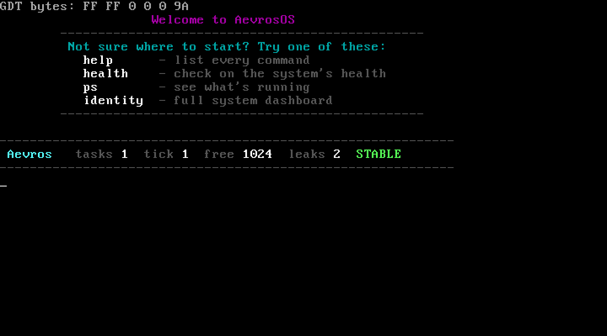
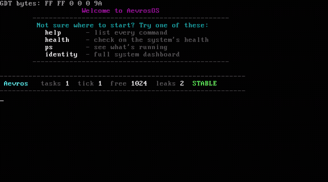
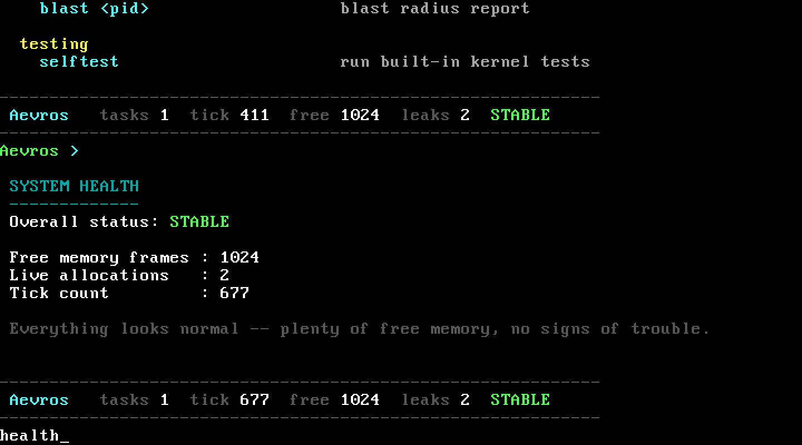
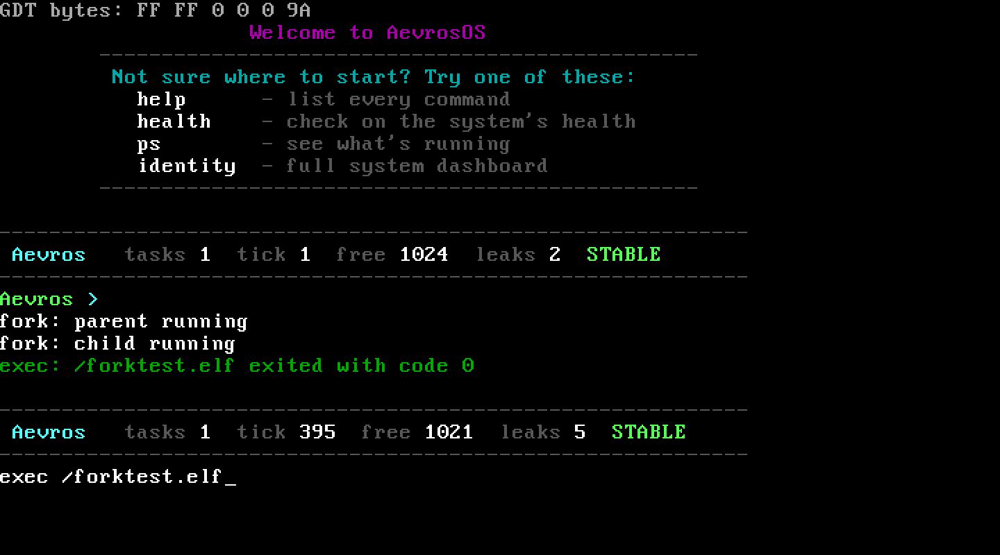

<div align="center">

# Aevros

**An operating system that explains itself.**

[](https://en.wikipedia.org/wiki/C_(programming_language))
[](#)
[](#)
[](LICENSE)

[Philosophy](docs/PHILOSOPHY.md) • [Architecture](docs/ARCHITECTURE.md) • [Shell Commands](docs/COMMANDS.md) • [Building](docs/BUILDING.md) • [Contributing](CONTRIBUTING.md)

</div>

---



*Real screenshot, booted straight off the ISO in QEMU. Not a mockup.*

## Full feature tour, ~70 seconds



Every frame above is the actual kernel running in QEMU, screen-captured live, not staged. It walks `help`, `identity`, `health`, `meminfo`, `exec`/`fork`, `ps`, `memstory`, `memstory ghosts`, `fdleak`, `memfreeze`, `stackmap`, `whyalive`, `outlook`, `timeline`, `quarantine`, `blast`, and `selftest`, in that order, on a freshly booted system. Higher quality version: [`docs/images/aevros-demo.mp4`](docs/images/aevros-demo.mp4).

## What is Aevros

Aevros is a small operating system kernel, written from scratch in C and x86 assembly. You can boot it in a couple minutes and start asking it questions.

Most teaching kernels show you *what* happened. Aevros tries to tell you *why*. It has its own memory manager, its own scheduler, its own filesystem, its own shell, all built by hand, nothing borrowed from an existing kernel's code or design.

The part that actually makes it different: a handful of built-in tools let the running system explain its own state, in plain sentences, from inside the shell. Kill a process and ask what would've broken first. Find a suspicious allocation and ask who owns it and whether that owner's even still alive. Trigger a page fault and get a sentence back instead of a raw hex dump.

That's the whole point of the project, a kernel that can answer "why" about itself. Full writeup in [`docs/PHILOSOPHY.md`](docs/PHILOSOPHY.md).

## Seeing it run

This is the `health` command, one of the introspection tools, reporting on the system live:



And this is `fork()` and `exec()` actually running, a process forking into a parent and a child, then loading and running an ELF binary:



No debugger. No print statements added for the screenshot. The kernel just answers the question directly, this is what it looks like doing that.

## Core ideas

- **Nothing borrowed.** The physical memory manager, buddy and slab allocators, paging code, scheduler, VFS, ELF loader, and shell are all original, written to actually understand each piece rather than copy a known-good design.
- **State is logged, not just changed.** Every task keeps a history of what happened to it. Every allocation is tied back to a file, a line, and an owning process. Nothing changes silently.
- **Failures explain themselves.** A page fault doesn't just print a faulting address, it tells you in a sentence what kind of access failed and what that usually means. See [`decode_fault`](kernel/Paging/Aevros_Panic/aevros_panic.c) and the panic screen built on top of it.
- **Built to be read, not just run.** A subsystem and the tool that explains it live next to each other in the tree. `kernel/Process/Blast` sits right beside `kernel/Process/task.c`.

## What's implemented

| Area | Status | Notes |
|---|---|---|
| Boot (Multiboot, GRUB) | Working | `boot/boot.s`, boots under QEMU |
| GDT / IDT / PIC / interrupts | Working | Flat segmentation, remapped PIC, ISR/IRQ dispatch |
| Physical memory manager (PMM) | Working | Bitmap-based frame allocator |
| Paging | Working | Page directories/tables, page fault decoding |
| Buddy allocator | Working | Power-of-two physical block allocator |
| Slab allocator | Working | Fixed-size object caching on top of the buddy allocator |
| Kernel heap (`kmalloc`/`kfree`) | Working | Backed by the slab/buddy layers |
| Allocation tracker | Working | Every live allocation is tied to a file, line, function, and pid |
| Tasking / scheduler | Working (cooperative) | Ready queue, context switching, not preemptive yet |
| Fork / Exec | Working | `fork()` clones a task, `exec()` loads and runs an ELF binary |
| ELF loader | Working | Loads flat ELF binaries built for the `User/` toolchain |
| Syscalls | Working | `int 0x80` gate: write, read, open, close, fork, exit, waitpid, exec |
| Virtual filesystem (VFS) | Working | Unified dentry/inode tree over pluggable backends |
| RAMFS | Working | In-memory filesystem, the default root |
| DevFS | Experimental | Device node registration, inode resolution still being hardened |
| Shell | Working | Built-in commands, tokenizer/parser, colored output |
| Checkpoint / restore (`AevrosPoint`) | Working | Save and restore a task's full state under a name |
| Task lifetime log (`TaskLife`) | Working | Every task keeps an event history: created, forked, exited, quarantined |
| Liveness inspector (`WhyAlive`) | Working | Explains why an inode, task, or allocation is still alive |
| Leak scanner (`FDLeak`) | Working | Finds file descriptors that were opened and never closed |
| Blast radius (`Blast`) | Working | Simulates what killing a task would break, before you kill it |
| Quarantine | Working | Auto-freezes (never kills) tasks that look like they're leaking |
| Memory snapshots (`MemFreeze`) | Working | Snapshots allocator state, diffs it later |
| Self-test suite (`selftest`) | Working | In-kernel sanity checks, runs on demand |
| User space / ring 3 | Partial | Programs run through `exec`, full isolation still maturing |

Every "Working" row ships with a self-test in `kernel/selftest.c`, run it yourself with `selftest`. Nothing in this table is aspirational, it's what's actually in the tree right now.

## Try it

```bash
git clone https://github.com/Mobeen0119/Aevros.git
cd Aevros
./build.sh
qemu-system-i386 -cdrom aevrosos.iso
```

Full requirements, per-platform install commands, and what to expect on first boot: [`docs/BUILDING.md`](docs/BUILDING.md).

## Documentation map

| Document | What's in it |
|---|---|
| [`docs/PHILOSOPHY.md`](docs/PHILOSOPHY.md) | Why Aevros exists, and what "a kernel that explains itself" actually means |
| [`docs/ARCHITECTURE.md`](docs/ARCHITECTURE.md) | Full system design, subsystem by subsystem, with diagrams and a real memory map |
| [`docs/COMMANDS.md`](docs/COMMANDS.md) | Every shell command, shown running for real, with screenshots |
| [`docs/BUILDING.md`](docs/BUILDING.md) | Toolchain setup, build steps, QEMU, troubleshooting |
| [`CONTRIBUTING.md`](CONTRIBUTING.md) | How to propose changes, conventions, PR process |
| [`CODE_OF_CONDUCT.md`](CODE_OF_CONDUCT.md) | Expected behavior in the project's spaces |
| [`SECURITY.md`](SECURITY.md) | How to report a vulnerability |

## Project layout

```text
Aevros/
├── boot/            Multiboot entry point (assembly) and GRUB config
├── kernel/
│   ├── CPU/         GDT, IDT, TSS
│   ├── Memory/      PMM, paging, buddy allocator, slab allocator, heap,
│   │                allocation tracker, memory snapshots
│   ├── Paging/      Page fault handling and the self-explaining panic screen
│   ├── Process/     Scheduler, tasks, fork/exec, and the introspection
│   │                tools (WhyAlive, Blast, Quarantine, TaskLife, ...)
│   ├── Syscall/     The int 0x80 syscall gate and dispatcher
│   ├── VFS/         Virtual filesystem tree, RAMFS
│   ├── Dev/         Device filesystem (experimental)
│   ├── ELF/         ELF binary loader
│   └── Shell/       The interactive shell and its built-in commands
├── Drivers/         Keyboard, TTY, PIT (timer)
├── Lib/             Freestanding string/printf/math helpers
├── Include/         Shared public headers
├── User/            Userspace test programs and their linker scripts
└── build.sh         One-command build: assembles, compiles, links, makes the ISO
```

## Status and stability

Aevros is under active development. Subsystems get rewritten as understanding improves, they don't get left alone just because they work. If you're evaluating this for anything beyond learning and experimentation, don't, not yet. That's not false modesty, it's just accurate: no full ring 3 isolation, no preemptive scheduler.

## License

MIT, see [`LICENSE`](LICENSE). Use it, modify it, ship it, including commercially, just keep the license and copyright notice attached.

## Contributing

Contributions welcome. Read [`CONTRIBUTING.md`](CONTRIBUTING.md) first, then [`docs/ARCHITECTURE.md`](docs/ARCHITECTURE.md) to get oriented before touching a subsystem. Issues tagged `good-first-issue` are a decent place to start.
