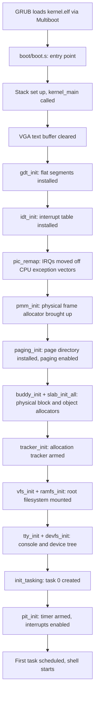
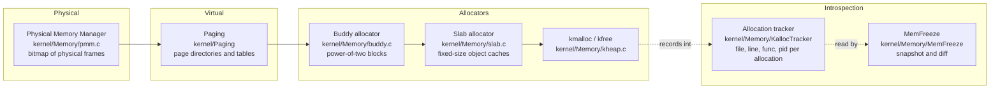
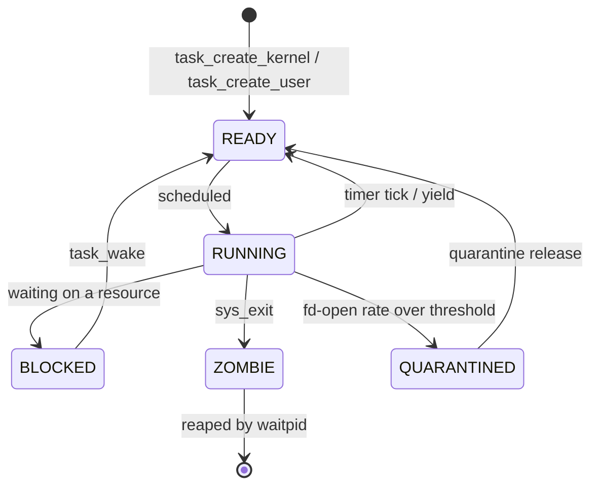
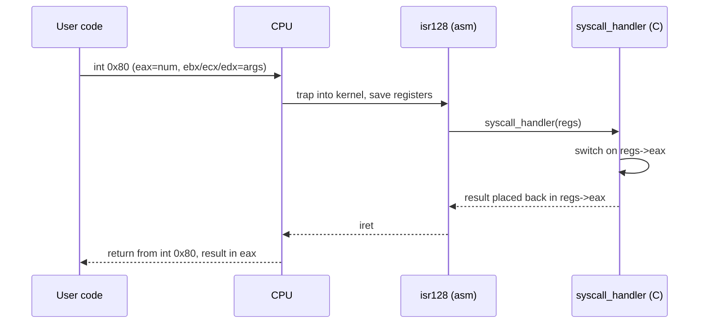
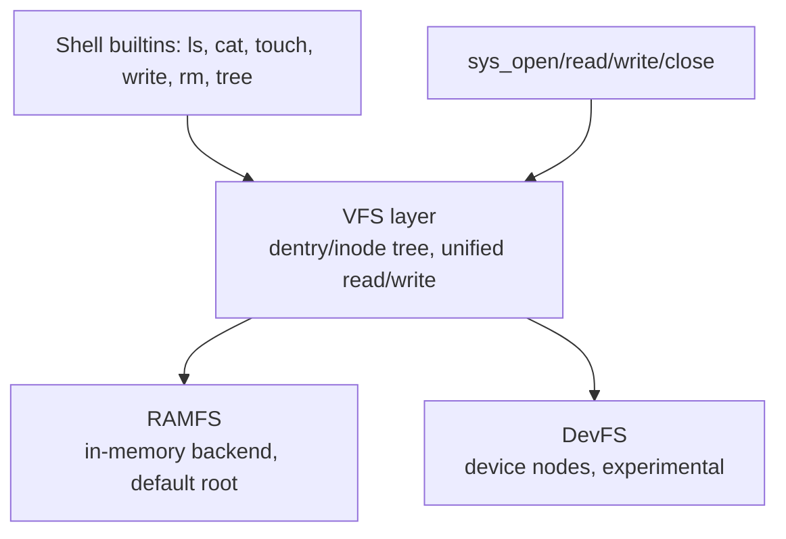
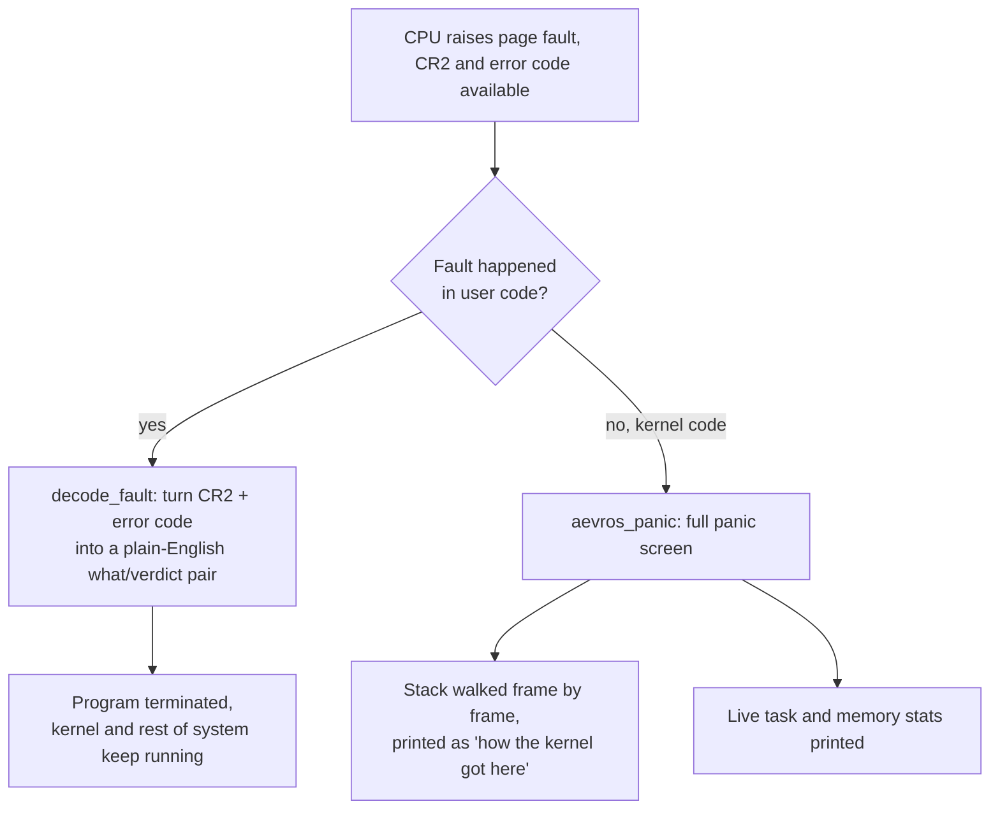

# Architecture

How Aevros is put together, from the moment GRUB hands over control to a shell command actually running a program. Read [`PHILOSOPHY.md`](PHILOSOPHY.md) first if you haven't, it explains *why* several of these subsystems look the way they do, this doc is more about the *how*.

Targets 32-bit x86. Nothing here depends on another kernel's source, headers, or design, beyond what the Multiboot spec and the x86 architecture itself require you to follow.

## 1. Boot flow



Every step in that list is a real, separate initialization call in `kernel/main.c`, in that order, because later steps depend on earlier ones (paging needs the PMM, the heap needs paging, tasking needs the heap and the VFS). If you're adding a new subsystem that needs memory or filesystem access, its `_init()` call belongs after those in `kernel_main`.

## 2. Memory management

Aevros layers its memory management the same way most real kernels do, and each layer is a separate, inspectable piece:



- **PMM** hands out raw physical page frames using a bitmap. It knows nothing about virtual addresses.
- **Paging** builds the page directory and page tables that map virtual addresses to those frames, and installs the page fault handler.
- **Buddy allocator** manages larger physical regions in power-of-two sized blocks, so the kernel can request "a block big enough for N bytes" without wasting the whole frame.
- **Slab allocator** sits on top of the buddy allocator and caches fixed-size objects (like `task_t` structures) so repeated alloc/free cycles for the same kind of object don't repeatedly go through the buddy allocator.
- **`kmalloc`/`kfree`** is the general-purpose interface most of the kernel actually calls.
- **The allocation tracker** is not a separate allocator, it's a ledger. Every `kmalloc` call is recorded with the call site (file, line, function) and the pid that made it. This is what `whyalive alloc <addr>`, `memstory`, and `memstory ghosts` read from. A "ghost" is an allocation whose owning pid has since died, which usually means a missing `kfree` on an exit path.

### 2.1 Memory map: what actually lives where

The section above covers the *layers*. Here's the more concrete version: freeze the machine right after boot, look at physical memory address by address, what's actually there, and why. Every number below is real, pulled straight from `kernel/main.c` and `linker.ld`, nothing simplified for the example.

Quick note first, for anyone new to this: memory is just one long strip of numbered boxes, called addresses, starting at `0x00000000`. The `0x` just means the number's written in hexadecimal instead of base-10, that's the convention low-level code uses because it lines up cleanly with how memory hardware is organized. You don't need to convert it in your head, just read it as "a specific spot in memory," the same way a street address is a specific spot on a map.

```text
0x00000000  ┐
            │  Reserved by the PC itself (BIOS, real-mode area).
            │  Aevros does not touch this.
0x000B8000  ├─ VGA text buffer. Every character your shell prints
            │  is written directly into this memory, by hand, no driver
            │  abstraction in between. This is *why* early boot code
            │  can print "HI2" to the screen before anything else
            │  is even initialized (see boot/boot.s).
0x00100000  ┼═ THE 1 MIB MARK. This is where the kernel itself is
  (1 MiB)   │  loaded. linker.ld pins this with ". = 0x00100000;".
            │  Everything below this line is old PC-compatibility
            │  territory kernels avoid; everything above is free
            │  to organize however the kernel wants.
            │
            │  kernel code, data, and globals live here
            │  (exact size depends on what you last built)
            │
kernel_end  ┼─ The linker marks this label automatically, right after
 (varies)   │  the kernel's own code and data, page-aligned. This is
            │  the first address that is genuinely free.
            │
free_start  ┼─ kernel_end rounded up to the next 4 KiB page boundary.
            │  This is where the Physical Memory Manager (PMM) starts
            │  handing out frames.
            │
            │  PMM region: 4 MiB (0x400000) of raw physical frames,
            │  tracked one bit per frame in a bitmap. This is the
            │  most primitive layer, it just answers "is this frame
            │  free or not," nothing fancier.
            │
buddy_start ┼─ free_start + the 4 MiB PMM region. From here up, the
            │  buddy allocator takes over, handing out larger
            │  power-of-two-sized physical blocks instead of single
            │  frames (see the diagram above).
            │
            │  Buddy region: normally runs up to 0x2800000 (40 MiB)
            │  if the machine reports at least that much RAM, or a
            │  smaller safe fallback (8 MiB above buddy_start) if it
            │  doesn't. Everything the kernel heap (kmalloc/kfree)
            │  ultimately hands out traces back to a block from here.
buddy_end   ┘
```

In table form, if the diagram above is easier to skim as a reference:

| Region | Starts at | Size | Plain-English purpose |
|---|---|---|---|
| Reserved / real-mode area | `0x00000000` | up to 1 MiB | Belongs to the PC platform, not touched by Aevros |
| VGA text buffer | `0x000B8000` | 4000 bytes (80x25 characters x 2 bytes each) | The literal screen you're looking at; writes here appear on screen instantly, no driver in between |
| Kernel image | `0x00100000` (the "1 MiB mark") | however big the last build was | The kernel's own compiled code and data, this is what `kernel.elf` gets loaded into |
| PMM region | `kernel_end`, page-aligned | 4 MiB (`0x400000`) | Raw physical page frames, tracked one bit per frame: free or used, nothing more |
| Buddy allocator region | right after the PMM region | up to 40 MiB (`0x2800000`), or 8 MiB if less RAM is detected | Larger reusable blocks handed out in power-of-two sizes; this is what the kernel heap is actually built on top of |

Why walk through this at all, instead of just saying "there's a heap"? Because it's the same idea the rest of this document keeps coming back to: nothing in Aevros happens "somewhere," everything happens at a specific, nameable place, for a specific, traceable reason, and that's true all the way down to the raw address level, not just at the API level. If you ever see a crash with a faulting address in the panic screen (`docs/ARCHITECTURE.md#6-faults-and-panics`), this table is what lets you work out by hand whether that address was supposed to be valid at all.
- **`MemFreeze`** takes a snapshot of the tracker's table and can diff it against a later snapshot, so you can answer "what did this command actually allocate" by snapshotting before and after.

## 3. Processes and scheduling



A task (`task_t`, in `kernel/Process/task.h`) owns a page directory (`cr3`), a kernel stack, a register save area, a file descriptor table, a working directory, and a small ring buffer of the last events that happened to it (`task_event_t events[TASK_MAX_EVENTS]`). Tasks live on a circular ready queue (`ready_queue`) and a flat list of every task that has ever existed (`all_tasks`), which is what lets tools like `ps` and `blast` walk the whole system rather than just the runnable set.

**Context switching** (`kernel/Process/content_switch.asm`) saves the callee-saved registers and instruction pointer of the outgoing task and restores them for the incoming one. It is currently cooperative: a switch happens on a timer tick or a syscall that blocks, there is no priority-based preemption yet (see the "Known limitations" table in the README).

**Fork** (`do_fork`, `kernel/Process/fork.c`) duplicates the calling task's address space and file descriptor table and gives the child a new pid.

**Exec** (`kernel/Process/exec.c` + `kernel/ELF/elf.c`) reads an ELF binary through the VFS, validates its headers, maps its segments into a fresh address space, and hands control to its entry point. The two test binaries the kernel writes into RAMFS at boot (`/exectest.elf`, `/forktest.elf`) exist specifically so `exec` and `fork` have something real to run without needing a disk.

### The introspection layer

This is the part that is specific to Aevros. It lives directly next to the process code it inspects, one small module per question:

| Module | Directory | Answers |
|---|---|---|
| `TaskLife` | `kernel/Process/TaskLife` | "What has happened to this task, in order?" |
| `WhyAlive` | `kernel/Process/WhyAlive` | "Why does this task, inode, or allocation still exist?" |
| `Blast` | `kernel/Process/Blast` | "What breaks if I kill this task, before I kill it?" |
| `Quarantine` | `kernel/Process/Quarantine` | Watches automatically, freezes tasks whose fd-open rate looks like a leak |
| `FDLeak` | `kernel/Process/FDLeak` | "Which tasks are holding file descriptors they never closed?" |
| `OutLook` | `kernel/Process/OutLook` | A system-wide scan for the same kind of anomalies `whyalive` checks one object at a time |
| `StackMap` | `kernel/Process/StackMap` | "How much of this task's stack is actually in use?" |
| `TIMELINE` | `kernel/Process/TIMELINE` | A merged, system-wide view of every task's event log |
| `AevrosPoint` | `kernel/Process/AevrosPoint` | Save and restore a task's complete state under a name, a manual checkpoint |

See [`docs/COMMANDS.md`](COMMANDS.md) for each of these run against a real task.

## 4. Syscalls



The syscall ABI is deliberately small and stable: `eax` is the syscall number, `ebx`/`ecx`/`edx` are up to three arguments, and the result comes back in `eax`. The currently implemented numbers are defined in `kernel/Syscall/syscall.h`:

```c
#define SYS_WRITE   1
#define SYS_READ    2
#define SYS_OPEN    3
#define SYS_CLOSE   4
#define SYS_FORK    5
#define SYS_EXIT    6
#define SYS_WAITPID 7
#define SYS_EXEC    8
```

An unrecognized syscall number does not crash the kernel, it returns `-1` in `eax`. This is covered directly by an in-kernel self-test (`test_syscall_dispatch` in `kernel/selftest.c`), which calls `syscall_handler` with a bogus number and asserts the kernel survives and returns the right error.

## 5. Virtual filesystem



Every path in Aevros resolves through a tree of `dentry_t` nodes, each pointing at an `inode_t` that describes size, flags, a reference count, and an operations table (`vfs_ops_t`) with `read`/`write` function pointers. This indirection is what lets RAMFS and DevFS both live under the same tree without the rest of the kernel caring which one is answering a given path.

**RAMFS** is the default root: files live entirely in memory, backed by the kernel heap. It's what the boot sequence writes the ELF test binaries into, and what the shell's file commands (`ls`, `cat`, `touch`, `write`, `rm`, `tree`) operate on by default.

**DevFS** registers device nodes (`devfs_register`) that map a name to an inode, the same way `/dev` does on a Unix system. It's marked experimental in the README because inode resolution for device nodes is still being hardened, not because the registration mechanism itself is unfinished.

Every open file descriptor (`file_t`) holds a pointer to both the dentry and the inode it resolved to, plus a reference count. This is the exact bookkeeping `whyalive inode <path>` and `blast <pid>` read to answer "who is holding this file" and "what would happen to it if this task went away".

## 6. Faults and panics



A fault in user code is recoverable: the offending program is terminated and the rest of the system keeps running, with a message explaining what kind of access failed (`kernel/Paging/page_fault.c`). A fault in kernel code is not recoverable, and `aevros_panic()` (`kernel/Paging/Aevros_Panic/aevros_panic.c`) takes over: it decodes the same CR2/error-code bits into a sentence, walks the stack frame pointers to print a readable call chain, and prints memory and task statistics before halting, so the very last thing the kernel does is still trying to explain itself. This mechanism is the concrete example referenced throughout [`PHILOSOPHY.md`](PHILOSOPHY.md).

## 7. The shell

The shell (`kernel/Shell`) is a straightforward read-tokenize-dispatch loop (`shell.c`, `parser.c`), not a full POSIX shell: no pipes, no background jobs, no scripting, just a command and its arguments. Its job is to be a thin, readable front end to everything described above. If you add a new kernel-level capability, the expectation is a corresponding shell command gets added in the same PR (see [`CONTRIBUTING.md`](../CONTRIBUTING.md)), and it gets a line in the `help` command's output in `shell.c`.

`MemInfo`, `Identity`, `Shell_Health`, and `Shell_UI` under `kernel/Shell/` are presentation-layer helpers (formatting the `meminfo` output, the `identity` dashboard, colored output) rather than independent subsystems.

## 8. Where new code should go

| You're adding... | It probably belongs in |
|---|---|
| A new syscall | `kernel/Syscall/syscall.c` (dispatch) + wherever the actual logic lives (e.g. `kernel/Process` for a process-related call) |
| A new filesystem backend | A new directory under `kernel/VFS`, registered against the `vfs_ops_t` interface the same way RAMFS is |
| A new introspection tool | A new small directory under `kernel/Process` or `kernel/Memory`, next to the subsystem it inspects, following the `WhyAlive`/`Blast` pattern: one focused question, one plain-English verdict |
| A new shell command | `kernel/Shell/shell.c` dispatch table, plus a `help_line(...)` entry, plus a builtin function if it's simple enough to live in `builtins.c` |
| A new driver | `Drivers/`, following the existing `keyboard.c` / `tty.c` / `PIT` structure |

If you're not sure where something goes, open a draft PR or a discussion issue before writing the implementation. See [`CONTRIBUTING.md`](../CONTRIBUTING.md).