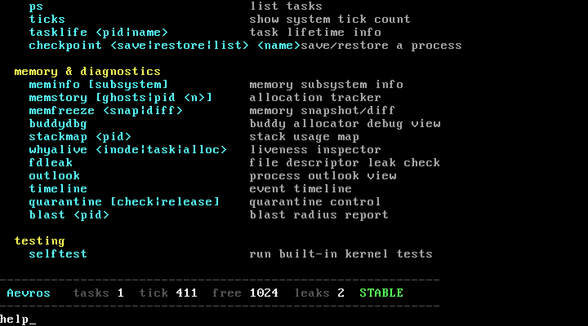
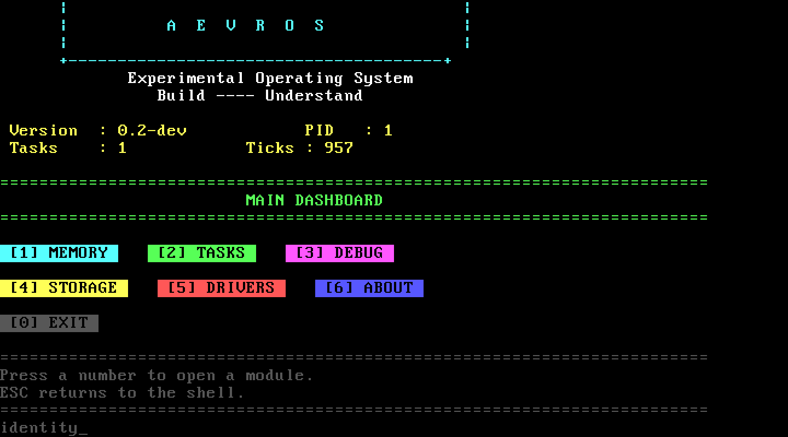
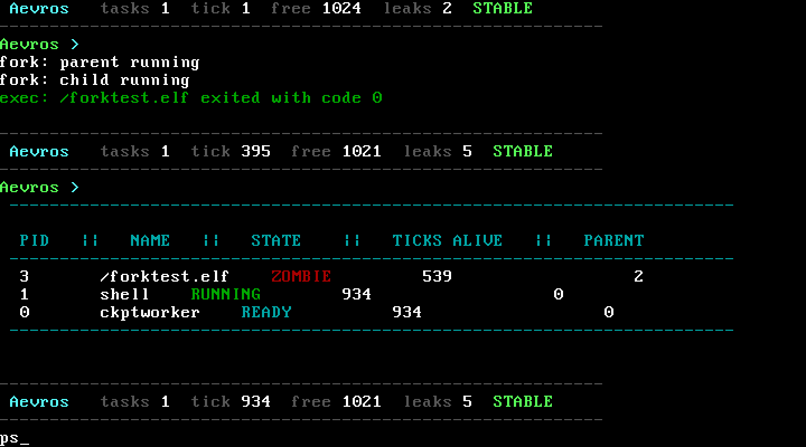
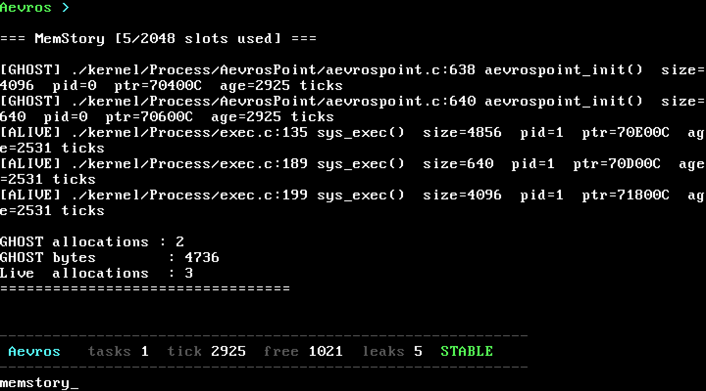
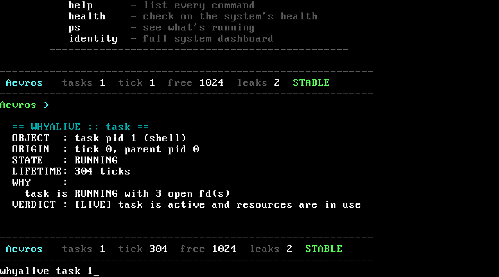
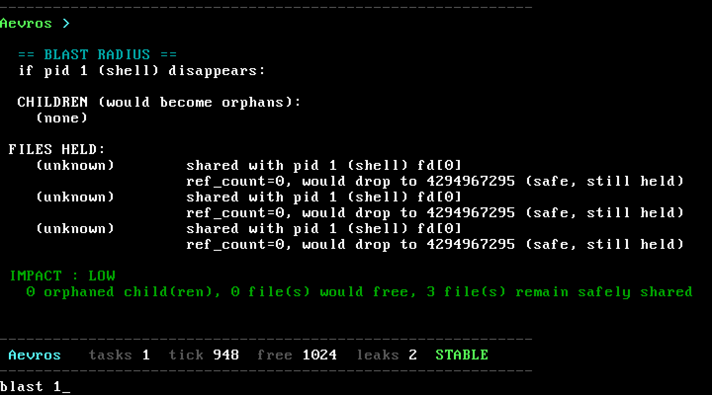
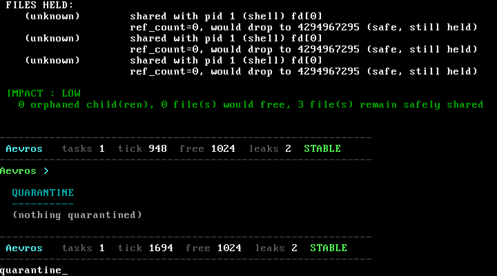

# Shell commands, shown running for real

Not a flat command reference. Every command below is either shown as a real screenshot from a booted VM, or a real session transcript, because the point of Aevros's shell is that the commands *are* the documentation for what's behind them. For the full one-line list, run `help` inside the shell, it's the same list this doc is organized around.

Want all of this in motion instead of stills? [`docs/images/aevros-demo.gif`](images/aevros-demo.gif) (or the sharper [`aevros-demo.mp4`](images/aevros-demo.mp4)) is a ~70 second, unstaged run through most of the commands below, captured straight from a booted VM.

Every command lives in the dispatch table in `kernel/Shell/shell.c`. Add a subsystem and a command for it, add a matching entry here in the same PR.

---

## General

### Boot and `help`

This is what you see on first boot, straight off the ISO:


And `help`, run right after, listing every command grouped by category:



If you're adding a command, add its `help_line(...)` entry in `shell.c` at the same time, this list is generated from that table, they don't drift apart.

### `identity`

A full-screen dashboard: version, uptime, current pid, task count, memory summary, with a small menu to dig into each area.



Numbered options open a module (memory, tasks, debug, storage, drivers, about), `ESC` drops you back to the shell. It's the "what is this system, right now" command, worth running right after boot or after recovering from a crash.

### `health`

A one-shot, plain-English read on system health: `STABLE`, `LOW MEMORY`, `CRITICAL`, `MEMORY LEAK`, or `HIGH LOAD`, plus the numbers behind the verdict and a sentence explaining what it means.


### `clear`

Clears the screen. Nothing to explain there.

---

## Filesystem

Small and predictable, all going through the VFS described in [`ARCHITECTURE.md`](ARCHITECTURE.md#5-virtual-filesystem), which is what lets `whyalive inode` and `blast` reason about files at all.

```text
Aevros > touch notes.txt
Aevros > write notes.txt "first boot went fine"
Aevros > cat notes.txt
first boot went fine
Aevros > ls
notes.txt
Aevros > tree
/
└── notes.txt
Aevros > rm notes.txt
```

`echo <text> > <file>` redirects into a file the same way `write` does, kept as a separate form because it's what people already expect from a shell.

`pwd` and `cd <dir>` track the current task's working directory (`task->cwd`), per-task, not global.

---

## Processes

### `exec` and `fork`, actually running

This is a real, captured session. `exec /forktest.elf` loads and runs a small program that forks itself, prints from both the parent and the child, then exits:


`fork` (with no argument) runs that same bundled demo, useful for exercising `do_fork` without building your own test binary. `exec <file>` loads any ELF binary through the VFS and starts it as a new task.

### `ps`, right after that

Also a real capture, taken moments later. Note the second row, `ckptworker`, that's not something you started, it's a background task the checkpoint subsystem (`AevrosPoint`) keeps running on its own:



`ps` lists every task Aevros has ever created (`all_tasks`), not just the runnable ones, a task that just exited can still show up until something reaps it. `ticks` prints the raw tick counter everything else is timed against.

### `tasklife <pid>`

Reads a task's own event log directly, every CREATED, FORKED, FD_OPEN, FD_CLOSE, EXITED, QUARANTINED event it's ever had, timestamped in ticks since creation. Point it at a pid that's still running, a task that already exited and got reaped won't have anything left to read, which is itself useful information, it tells you the task is fully gone, not just idle.

### `checkpoint save|restore|list <name>`, aka AevrosPoint

A manual, named snapshot of one task's complete state. Think of it as a save point for a process.

```text
Aevros > checkpoint save before-crash
[AevrosPoint] saved task pid 3 as 'before-crash'

Aevros > checkpoint list
  before-crash   (pid 3, saved at tick 900)

Aevros > checkpoint restore before-crash
[AevrosPoint] pid 3 restored from 'before-crash'
```

Useful for reproducing a bug: get a task into the exact state right before something breaks, save it, cause the problem, restore, try a fix, no reboot needed.

---

## Memory and diagnostics

This is where "the kernel explains itself" is most visible. Read [`PHILOSOPHY.md`](PHILOSOPHY.md) first if you haven't, these commands are the direct implementation of that idea.

### `meminfo [pmm|heap|paging|task|buddy|slab]`

A summary per subsystem. No argument shows everything, or narrow it down, `meminfo buddy` for just the buddy allocator's free lists.

### `memstory [ghosts | pid <n>]`

Reads the allocation tracker directly. Here's a real capture, taken after booting and running the fork/exec demo above:



Two GHOST entries from `aevrospoint_init()`, allocations whose owning pid is already gone, worth a look if you're chasing a leak in the checkpoint subsystem. `memstory ghosts` filters straight to the ghost rows. `memstory pid <n>` filters to one task.

### `whyalive <inode <path> | task <pid> | alloc <addr>>`

The single-object version of the same question `memstory ghosts` answers in bulk. Real capture, `whyalive task 1` run against the shell's own pid:



`whyalive inode <path>` cross-checks an inode's `ref_count` against the file descriptors actually pointing at it across every task: `OK`, `LEAK` (ref_count says it's held, nobody's holding it), or `MISMATCH` (the numbers don't agree). `whyalive task <pid>` explains why a task's still around, most useful on a zombie: it names the exact parent pid that hasn't called `waitpid` yet.

### `blast <pid>`

Simulates removing a task before you actually remove it, which children would be orphaned, which open files would really get freed versus stay shared, and an overall LOW/MEDIUM/HIGH impact call. Real capture, `blast 1` against the shell itself:



Worth calling out honestly since it's right there in the screenshot: the fd rows show up as `(unknown)`, `blast` doesn't resolve a shared fd back to a file name yet, it only knows the fd number and the ref count. You'll also see a `ref_count` reported as a huge number (`4294967295`) on a safely-shared fd, that's a `uint32_t` underflow when the display logic computes "ref_count minus one" on a count that's already effectively zero from `blast`'s point of view, not a real reference count. Both are known rough edges, not hidden ones, good first issues if you want one.

```text
Aevros > blast 3

  BLAST RADIUS
  if pid 3 (forktest) disappears:

  CHILDREN (would become orphans):
    (none)

  FILES HELD:
    /forktest.elf    ref_count=1, would drop to 0 and be reclaimed

  IMPACT : LOW
    0 orphaned child(ren), 1 file(s) would free, 0 file(s) remain safely shared
```
The block above shows the cleaner case, blasting a task that actually owns a named file outright, no underflow, no shared fds.

### `quarantine [check|release <name>]`

Not something you run to start, it's a safety net running on its own. If a task opens far more file descriptors than it closes inside a short tick window, the kernel freezes it (`TASK_QUARANTINED`) instead of letting it run away or killing it outright. `quarantine` with no argument lists what's frozen right now. Real capture, on a normal, nothing-wrong system:



Worth being straight about: every built-in shell command that opens a file (`cat`, `touch`, `write`) closes it again immediately, so there's currently no way to *trigger* a real quarantine event from the shell itself, the trigger needs a task that opens several file descriptors and leaks them, and no bundled test program does that yet. The screenshot above is genuinely accurate, just of the boring, nothing's-wrong case. A small `User/Programs` test binary that opens files in a loop without closing them would make this demonstrable end to end, and would be a solid first contribution if you want one, see [`CONTRIBUTING.md`](../CONTRIBUTING.md).

`quarantine check` forces an immediate sweep, `quarantine release <name>` puts a task back on the ready queue once you've decided it's fine. Here's what the kernel actually prints the moment a quarantine trips (from the source in `kernel/Process/Quarantine/Quarantine.c`, not yet captured live for the reason above):

```text
  [KERNEL] pid 7 (leaky) auto-quarantined at tick 240
           reason: fd open rate exceeded threshold (9 opened, 0 closed in 200 ticks)
           task frozen, not killed -- state preserved for inspection

Aevros > quarantine
  QUARANTINE
  ----------
  pid 7    leaky      quarantined

Aevros > quarantine release leaky
quarantine: pid 7 ..... leaky resumed
```

### `memfreeze <snap|diff>`

A before/after tool for memory. `memfreeze snap` records the current allocation tracker table, `memfreeze diff` compares live state against the last snapshot. Snap right before a command, diff right after, and you've got exactly what it cost in memory.

### `fdleak`

A system-wide sweep for file descriptors open unusually long relative to how active the owning task is, surfaced per task so you can see which process is the likely source.

### `outlook`

A broader system-wide scan, same spirit as `fdleak` and `memstory ghosts`, looking across every task for the same class of "this doesn't add up" signal in one combined view.

### `timeline`

Merges every task's individual event log into one system-wide, tick-ordered feed. `tasklife <pid>` answers "what happened to this task", `timeline` answers "what happened, system-wide, in what order."

### `stackmap <pid>`

Prints how much of a task's allocated stack is actually in use versus untouched, useful for sizing stacks correctly instead of guessing.

### `buddydbg`

A raw debug view of the buddy allocator's free lists, order by order. Lower-level than `meminfo buddy`, meant for working on the allocator itself, not diagnosing a leak.

---

## Testing

### `selftest`

Runs the in-kernel self-test suite (`kernel/selftest.c`) live, in the booted kernel, not a separate host-side runner. Checks the buddy allocator's free lists terminate, the heap allocates and survives a write, the ready queue terminates, the tokenizer splits arguments correctly, syscall dispatch handles bad input without crashing, and more. Each line prints `[PASS]` or `[FAIL]`.

```text
Aevros > selftest
-- buddy --
  [PASS] buddy list terminates
  [PASS] buddy_alloc(0) non-null
  [PASS] buddy list still finite after free
-- heap --
  [PASS] kmalloc_raw(64) non-null
  [PASS] write to allocated block doesn't fault
-- task list --
  [PASS] ready_queue terminates (no cycle)
-- tokenize --
  [PASS] tokenize('ls') argc==1
  [PASS] tokenize('ls') argv[0]=='ls'
  [PASS] tokenize('echo hi there') argc==3
  [PASS] tokenize argv[1]=='hi'
```

Add a subsystem, add a matching `test_<subsystem>` function here, same `CHECK(name, condition)` pattern. See [`CONTRIBUTING.md`](../CONTRIBUTING.md), new features are expected to ship with a self-test in the same PR.

`checktest` is separate: it runs `aevrospoint_full_test()` specifically, checkpoint save/restore under load, not the general suite.
