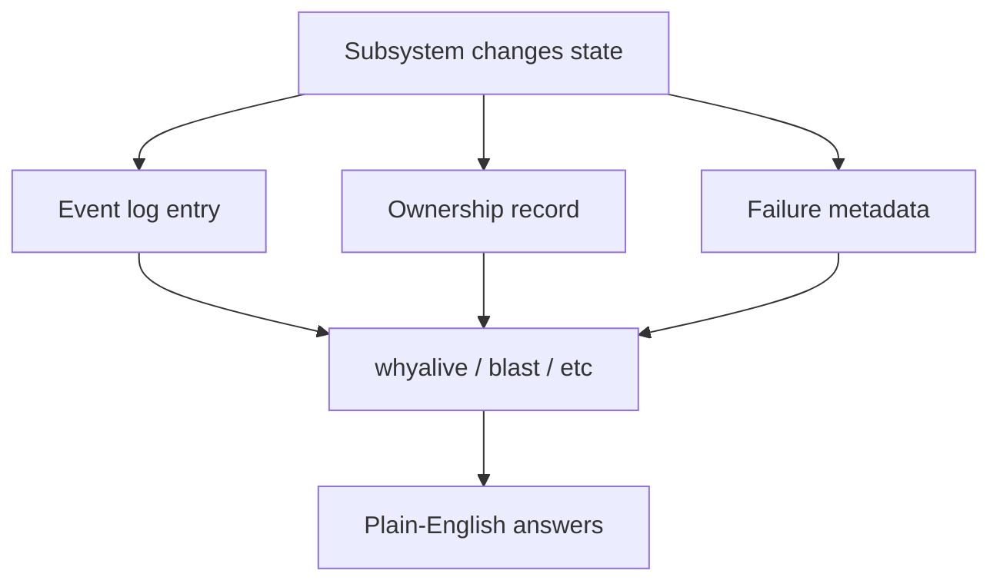

# Aevros: a kernel that explains itself

Most kernels are fast, “correct,” and completely useless when shit goes sideways.   
Aevros asks a different question: what if the kernel already knew *why* things broke, and you could just ask? 

---

## The problem

Debugging a hobby kernel usually looks like this:

- Add a `printf`.
- Rebuild.
- Reboot.
- Reproduce.
- Stare at a hex address.
- Cross‑reference symbols by hand.
- Guess. Repeat.

You don’t explore the system; you wrestle it until it stops screaming. 

Aevros wants the opposite: when it explodes, the kernel should already have the story written down. 

---

## What “explains itself” means

This is **not** “AI in the kernel” or a chatty copilot glued to ring 0.   
It’s simple: every subsystem that owns a resource leaves enough of a paper trail to answer direct questions in plain language. 

Three habits make that work.

---

### 1. State changes get logged

When a task is created, forked, handed a file descriptor, quarantined, or killed, that event goes into the task’s own event log (`kernel/Process/TaskLife`).   

The scheduler doesn’t just flip a state flag and fuck off; it leaves a trail you can replay later with:

```bash
tasklife <pid>
```

---

### 2. Ownership is tracked

Every heap allocation is recorded with file, line, function, and owning pid (`kernel/Memory/KallocTracker`).   
Every file descriptor is tied to its inode and the task holding it, so “who owns this” is a real answer, not a vibe check. 

---

### 3. Failures get decoded

A page fault doesn’t just dump an address and an error code and die.   
`decode_fault()` in `kernel/Paging/Aevros_Panic/aevros_panic.c` reads the same bits a human would and turns them into sentences like: 

- “tried to write to memory that’s mapped read‑only”
- “classic NULL pointer bug” when the address hugs zero

The panic screen then walks the stack frame by frame, narrating how the kernel got here as a call chain, not an address soup. 

---

## How the pieces fit 



This is the whole trick: subsystems leave evidence, tools read it, you get answers instead of guesswork. [web:3][web:4]

---

## The tools built on that

These aren’t bolted‑on gimmicks; they’re tiny programs that just read the paper trail and answer specific questions. 

### `whyalive`

> “Why does this still exist?”

Point it at an inode, task, or allocation; it cross‑checks live holders vs recorded refcount and returns one of: 

- `OK`
- `LEAK`
- `MISMATCH`
- `GHOST`

Same state, same verdict, every time. No vibes. 

---

### `blast`

> “What happens if I kill this?”

Before you smash a process, `blast` walks its children and open files and shows: 

- Which files actually get freed.
- Which are shared and stay safe.

So you don’t accidentally take half the system down with one impatient `kill`. 

---

### `quarantine`

Automatic “this task looks sketchy” mode.   

The kernel watches file descriptor churn and **freezes** (never silently kills) a task that crosses a threshold, so you can poke it exactly as it was when it misbehaved. 

---

### `memfreeze`

> “What changed?”

`memfreeze` snapshots allocator state and diffs it later to show who messed with memory.   

Perfect for catching the one function that keeps touching things it shouldn’t. 

---

### `fdleak` and `outlook`

System‑wide “does this add up?” sweeps.   

They apply the same logic as `whyalive`, but across the whole system instead of one object at a time. 

---

### `aevros_panic`

Last‑words mode. 

Even when it’s dying, the kernel spends its final cycles explaining why in plain language instead of dropping a generic halt screen and ghosting you.

---

## The bar for new subsystems

If you build a subsystem that manages a resource—memory, tasks, files, anything with a lifetime—it should be able to answer: 

- “Why do you still exist?”
- “What breaks if I remove you?”

Those aren’t stretch goals; that’s the baseline to ship. 

---

## Why this matters for Aevros

 It’s blunt about it: 

- Deep systems understanding.
- Build it yourself.
- Break it.
- See why it broke.
- Contribute (if u can).

A kernel that only tells you *that* something went wrong trains you to fear the red screen.  
A kernel that tells you *why* teaches you the mechanism—and makes breaking things fun instead of terrifying. 

> One line: every subsystem should be able to explain itself, in a sentence, to the person who just broke it. 

---

## What this philosophy isn’t

- Not “bug‑free” bragging; the tools exist because bugs happen, not instead of them. 
- Not AI, not fuzzy heuristics; same state, same answer, built from recorded facts. 
- Not an excuse for crap design; catching a leak with `whyalive` doesn’t replace cleanup code. 

---

## Applying it as a contributor

Before you call your subsystem “done,” ask:

1. If someone asks the kernel “why does this still exist,” can it answer without guessing?
2. If someone’s about to remove this, can the kernel explain what will break, or are they about to find out the hard way?

If the honest answer to either is “no,” you probably need one small introspection hook **now**, not after the first panic screenshot hits Discord. 

Check `docs/ARCHITECTURE.md` for how this fits into real subsystems, and `docs/COMMANDS.md` to see these tools running with screenshots. 